# Display Node UI Design

> Status: COMPLETE
> Related Requirements: FR-DN-001 through FR-DN-010
> Hardware: ILI9341 2.4" TFT (320x240), STMPE610 touchscreen

---

## Table of Contents

1. [Screen Overview](#screen-overview)
2. [Display Configuration](#display-configuration)
3. [Main Dashboard](#main-dashboard)
4. [Device Detail Views](#device-detail-views)
5. [Settings Screen](#settings-screen)
6. [Historical Data View](#historical-data-view)
7. [Navigation](#navigation)
8. [Touch Controls](#touch-controls)
9. [Visual Design](#visual-design)
10. [State Indicators](#state-indicators)
11. [Implementation Notes](#implementation-notes)
12. [Mockup Reference](#mockup-reference)

---

## Screen Overview

| Screen | Purpose | Priority | Touch Required |
|--------|---------|----------|----------------|
| Main Dashboard | Primary status overview | MVP | View only (tap for details) |
| Pool Node Detail | Pool sensor details and battery | MVP | Back navigation |
| Valve Node Detail | Fill status and manual controls | MVP | Fill start/stop buttons |
| Settings | Configuration and diagnostics | MVP | Reset, refresh buttons |
| Historical Data | Temperature charts (Phase 3) | Deferred | Range selection buttons |

### Screen Hierarchy

```text
Main Dashboard (home)
├── Pool Node Detail (tap pool section)
├── Valve Node Detail (tap outside/fill section)
└── Settings (tap time display)
    └── Historical Data (future)
```

---

## Display Configuration

### Hardware Specifications

| Parameter | Value |
|-----------|-------|
| Display | ILI9341 2.4" TFT |
| Resolution | 240 x 320 pixels |
| Color Depth | 16-bit (65,536 colors) |
| Orientation | Portrait (rotation: 270°) |
| Effective dimensions | 240 wide x 320 tall |

### Coordinate System

```text
(0,0) ─────────────────────> X (240)
  │
  │   Display Area (portrait mode)
  │
  │   Physical: 240 x 320 (portrait)
  │   Rotation: 270° (for cable orientation)
  │
  │
  │
  │
  ▼
  Y (320)
```

### Screen Zones

The display is divided into functional zones for consistent layout:

```text
┌───────────────────────────────┐
│         Header Zone           │ 0-70px
│      (date, time, status)     │
├───────────────────────────────┤
│                               │
│                               │
│        Content Zone           │ 70-205px
│   (temperatures, status data) │
│                               │
│                               │
├───────────────────────────────┤
│                               │
│         Chart Zone            │ 205-320px
│   (sparkline, nav buttons)    │
│                               │
└───────────────────────────────┘
```

---

## Main Dashboard

The main dashboard displays all critical information at a glance. This is the primary screen users interact with.

### Mockup

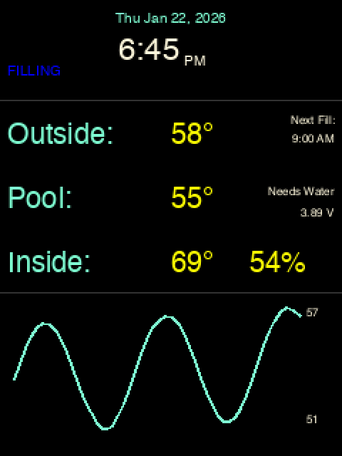

### Layout Description

The main dashboard is organized into three zones:

**Header Zone (0-70px):**
- Date centered at top (aqua text)
- Large time display centered below date (cornsilk text) - **tap to access Settings**
- AM/PM indicator to the right of time
- "FILLING" status indicator to the left of time (blue, only when active)

**Content Zone (70-205px):**
- Three temperature rows: Outside, Pool, Inside
- Left side: Labels and temperature values
- Right side: Contextual information (right-aligned)
  - Outside row: "Next Fill:" with scheduled time
  - Pool row: "Needs Water" status and battery voltage
  - Inside row: Humidity percentage

**Chart Zone (205-320px):**
- 24-hour temperature sparkline
- Min/max values displayed on right edge

### Element Specifications

These font sizes match the original implementation in `Poolio-DisplayNode/displayFunctions.py`:

| Element | Position | Font | Color | Alignment |
|---------|----------|------|-------|-----------|
| Date | Top center | 10pt | Aqua | Center |
| Time | Below date | 24pt | Cornsilk | Center |
| AM/PM | Right of time | 10pt | Cornsilk | Left |
| FILLING | Left of time | 10pt | Blue | Left |
| Temperature labels | Left column | 18pt | Aqua | Left |
| Temperature values | After labels | 18pt | Yellow | Left |
| Humidity | After inside temp | 18pt | Yellow | Left |
| Next Fill | Right side | 8pt | Cornsilk | Right |
| Needs Water | Right side | 8pt | Cornsilk | Right |
| Battery voltage | Right side | 8pt | Cornsilk | Right |
| Sparkline | Bottom | - | Aqua | - |
| Chart min/max | Right of chart | 8pt | Cornsilk | Right |

### Touch Zones (Main Dashboard)

| Zone | Bounds (x, y, w, h) | Action |
|------|---------------------|--------|
| Time display | (50, 20, 140, 45) | Navigate to Settings |
| Outside section | (0, 80, 240, 45) | Navigate to Valve Detail |
| Pool section | (0, 125, 240, 50) | Navigate to Pool Detail |

---

## Device Detail Views

### Pool Node Detail

Shows detailed pool sensor information with battery status. Message timing information is displayed here (not on main dashboard).

#### Mockup

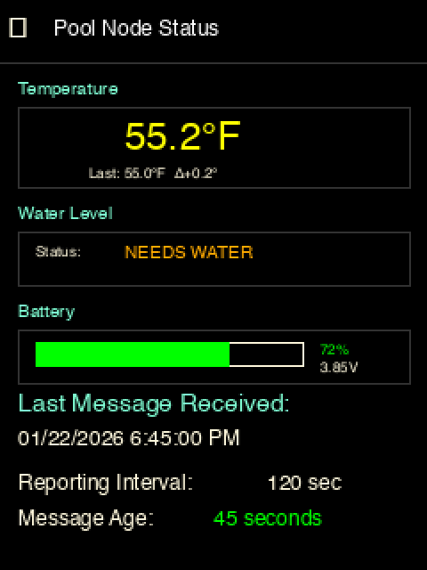

#### Layout Description

**Header:** Back button (←) and "Pool Node Status" title

**Temperature Section:**
- Large temperature display (24pt, yellow)
- Previous reading and delta trend

**Water Level Section:**
- Binary status display: "NEEDS WATER" (orange) or "OK" (green)
- No progress bar - water level is determined by float switch (on/off)

**Battery Section:**
- Visual battery bar with percentage fill
- Percentage and voltage displayed

**Message Status Section (prominent):**
- "Last Message Received:" header (14pt, aqua)
- Timestamp of last message (12pt)
- Reporting interval (12pt)
- Message age with color coding (green if fresh, orange/warning if stale)

#### Stale Data Indicator

When data is stale (>30 minutes old), the detail screen shows a warning banner:

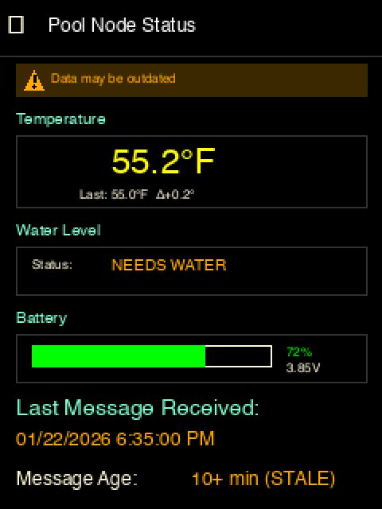

- Amber/orange background bar at top of content area
- Warning triangle icon (⚠)
- "Data may be outdated" message
- Message age shows "30+ min (STALE)" in orange

### Valve Node Detail

Shows fill controller status with manual controls.

#### Mockup (Idle)

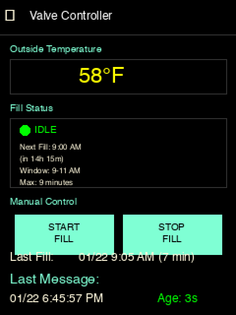

#### Mockup (Filling)

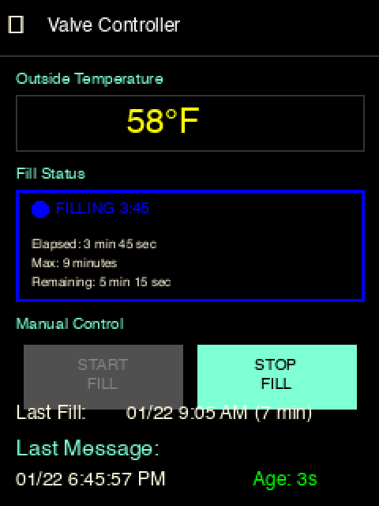

#### Layout Description

**Header:** Back button (←) and "Valve Controller" title

**Outside Temperature Section:**
- Large temperature display

**Fill Status Section:**
- Status indicator dot (green=IDLE, blue=FILLING)
- When IDLE: Next fill time, countdown, window, max duration
- When FILLING: Elapsed time, max duration, remaining time
- Blue border around section when actively filling

**Manual Control Section:**
- START FILL button (disabled when filling)
- STOP FILL button (always enabled)

**Message Status Section:**
- Last fill timestamp and duration (12pt)
- "Last Message:" header (14pt, aqua)
- Timestamp and message age (12pt)

#### Manual Fill Confirmation Dialog

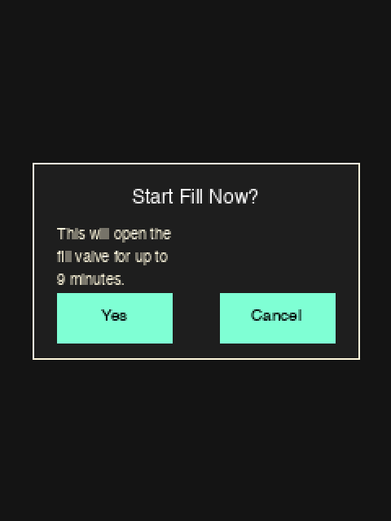

#### Touch Zones (Valve Detail)

| Zone | Bounds | Action |
|------|--------|--------|
| Back button | (0, 0, 60, 40) | Return to dashboard |
| START FILL | (15, 218, 100, 40) | Show confirmation dialog |
| STOP FILL | (125, 218, 100, 40) | Stop fill (immediate, no confirm) |
| Yes (dialog) | - | Send valve_start command |
| Cancel (dialog) | - | Dismiss dialog |

---

## Settings Screen

Displays system diagnostics and configuration options.

### Mockup

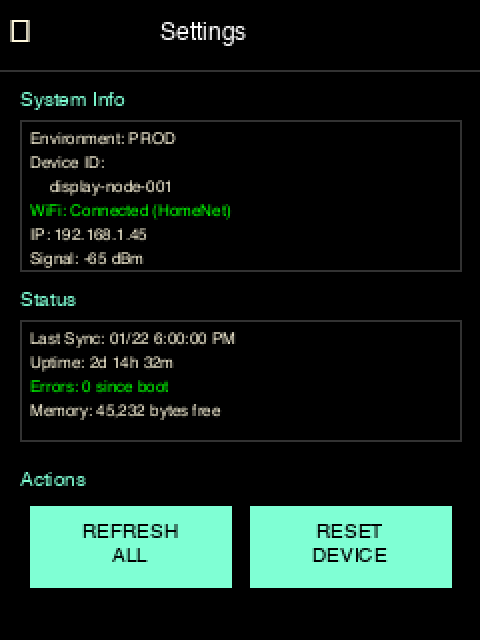

### Layout Description

**Header:** Back button (←) and "Settings" title

**System Info Section:**
- Environment (PROD/NONPROD)
- Device ID
- WiFi status and network name
- IP address
- Signal strength

**Status Section:**
- Last sync timestamp
- Uptime
- Error count since boot
- Free memory

**Actions Section:**
- REFRESH ALL button - re-fetch all data from cloud
- RESET DEVICE button - restart the display node

### Reset Confirmation Dialog

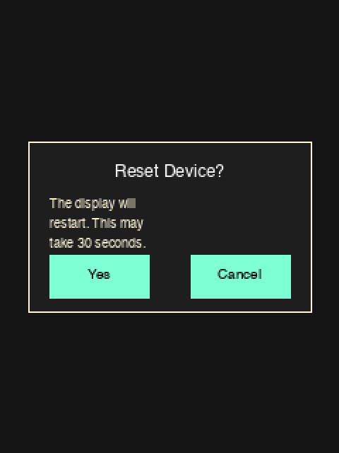

### Touch Zones (Settings)

| Zone | Bounds | Action |
|------|--------|--------|
| Back button | (0, 0, 60, 40) | Return to dashboard |
| REFRESH ALL | (15, 253, 100, 40) | Re-fetch all data from cloud |
| RESET DEVICE | (125, 253, 100, 40) | Show reset confirmation |

---

## Historical Data View

Temperature history visualization with multiple time ranges.

### 24-Hour View (Sparkline)

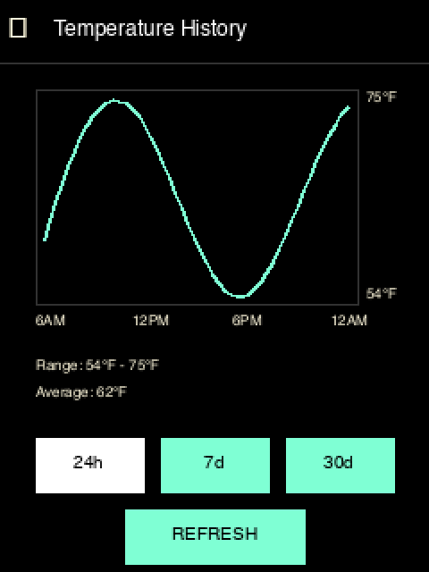

Uses a continuous sparkline chart showing temperature readings throughout the day.

- X-axis: Time labels (6AM, 12PM, 6PM, 12AM)
- Y-axis: Auto-scaled temperature range
- Data points: 5-minute resolution (288 points, sampled to 240)

### 7-Day View (Whisker Chart)

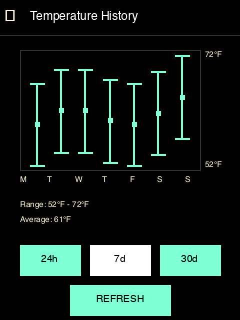

Uses a whisker/candlestick chart showing daily min/max ranges.

- X-axis: Day labels (M, T, W, T, F, S, S)
- Each bar shows:
  - Top cap: Daily maximum temperature
  - Bottom cap: Daily minimum temperature
  - Center square: Daily average temperature

### 30-Day View (Whisker Chart)

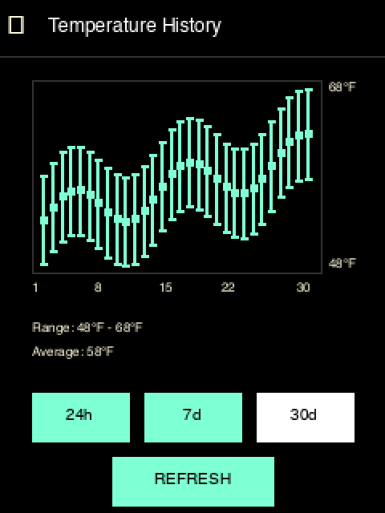

Uses a whisker chart showing daily min/max ranges for the past month.

- X-axis: Date labels (1, 8, 15, 22, 30)
- Same bar format as 7-day view

### Chart Specifications

| Parameter | 24h | 7d | 30d |
|-----------|-----|-----|-----|
| Chart type | Sparkline | Whisker | Whisker |
| Chart width | 240 pixels | 240 pixels | 240 pixels |
| Chart height | 120 pixels | 120 pixels | 120 pixels |
| Raw data points | 288 (5-min intervals) | 7 (daily) | 30 (daily) |
| Rendering | Downsample 288 → 240 pixels | 1 bar per day | 1 bar per day |
| Y-axis | Auto-scaled | Auto-scaled | Auto-scaled |

### Data Processing

**Sparkline Smoothing (24-hour view only):**

- Apply 3-point simple moving average to reduce noise in temperature readings
- Smoothing formula: `smoothed[i] = (raw[i-1] + raw[i] + raw[i+1]) / 3`
- Edge handling: First and last points use 2-point average
- Smoothing is applied after data retrieval, before rendering

*Note: Whisker charts (7-day and 30-day views) do not use smoothing. They display actual daily min/max/average values without modification.*

### Statistics Display

Below the chart:
- Range: Min°F - Max°F
- Average: Avg°F

### Range Selection Buttons

Three buttons to switch between time ranges:
- 24h (selected state shown with inverted colors)
- 7d
- 30d

REFRESH button to reload data from cloud.

---

## Navigation

### Navigation Flow Diagram

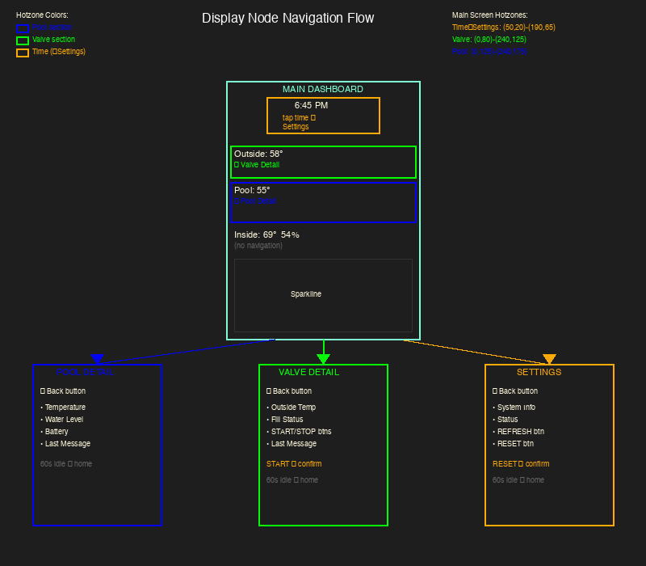

The diagram shows:
- Main dashboard with color-coded touch hotzones
- Arrows indicating navigation to detail screens
- Hotzone coordinates for implementation
- Content summary for each screen

### Navigation Pattern

The UI uses a **hub-and-spoke** navigation pattern with the Main Dashboard as the hub.

### Screen Transitions

| From | To | Trigger | Animation |
|------|-----|---------|-----------|
| Dashboard | Pool Detail | Tap pool section | Slide left |
| Dashboard | Valve Detail | Tap outside section | Slide left |
| Dashboard | Settings | Tap time display | Slide down |
| Any detail | Dashboard | Tap back button | Slide right/up |
| Any screen | Dashboard | Idle timeout (60s) | Fade |

### Idle Timeout

- **Trigger:** No touch input for 60 seconds (configurable)
- **Action:** Return to Main Dashboard
- **Exception:** Do not timeout during active fill operation

### Back Navigation

All detail screens include a back button in the top-left corner:

```text
┌───────────────────────────
│  [←]  Screen Title
```

- Touch target: 60 x 40 pixels minimum
- Visual: Left arrow icon or "←" text

---

## Touch Controls

### Button Specifications

All touch buttons follow these minimum specifications per FR-DN-008:

| Property | Value | Rationale |
|----------|-------|-----------|
| Minimum touch target | 44 x 44 pixels | iOS HIG recommendation |
| Recommended size | 100 x 40 pixels | Comfortable for adult fingers |
| Debounce interval | 250ms | Prevent double-taps |
| Visual feedback | Highlight on press | Immediate response |
| Press detection | Touch down | Not release (faster response) |

### Button States

```text
NORMAL           PRESSED          DISABLED
┌───────────┐    ┌───────────┐    ┌───────────┐
│  Button   │    │▓▓Button▓▓│    │  Button   │
└───────────┘    └───────────┘    └───────────┘
 Black text       Black text       Gray text
 on aqua          on white         on dark gray
```

### Confirmation Dialogs

Critical actions require confirmation per FR-DN-009:

| Action | Requires Confirmation | Reason |
|--------|----------------------|--------|
| Manual fill start | Yes | Opens physical valve |
| Manual fill stop | No | Safety action |
| Device reset | Yes | Service interruption |
| Refresh data | No | Non-destructive |

### Command Feedback

After sending a command, display feedback:

| State | Display | Duration |
|-------|---------|----------|
| Pending | Spinner + "Sending..." | Until response or timeout |
| Success | Checkmark + "Done" | 2 seconds |
| Failed | X mark + error message | 5 seconds or until tap |
| Timeout | Warning + "No response" | 5 seconds or until tap |

**Timeout:** 5 seconds for command acknowledgment

---

## Visual Design

### Color Palette

| Name | Hex | RGB | Usage |
|------|-----|-----|-------|
| Background | #000000 | (0, 0, 0) | Screen background |
| Text Primary | #FFFFFF | (255, 255, 255) | Important values |
| Text Secondary | #FFF8DC | (255, 248, 220) | Cornsilk - labels, timestamps |
| Accent | #7FFFD4 | (127, 255, 212) | Aqua - labels, chart line |
| Value | #FFFF00 | (255, 255, 0) | Yellow - temperature values |
| Alert | #FF3030 | (255, 48, 48) | Firebrick - errors only |
| Success | #00FF00 | (0, 255, 0) | Confirmations, fresh data |
| Status Active | #0000FF | (0, 0, 255) | Blue - "FILLING" indicator |
| Warning | #FFAA00 | (255, 170, 0) | Orange - stale data, nonprod |
| Stale Background | #3C2800 | (60, 40, 0) | Dark amber - stale row highlight |

### Color Usage by Context

| Context | Background | Foreground |
|---------|------------|------------|
| Normal status | Black | Cornsilk |
| Active indicator | Black | Blue |
| Stale data row | Dark amber (#3C2800) | Warning orange |
| Nonprod indicator | Black | Orange border |
| Button normal | Aqua | Black |
| Button pressed | White | Black |
| Button disabled | Dark Gray | Gray |

### Typography

Font sizes match the original implementation:

| Element | Size | Style |
|---------|------|-------|
| Date | 10pt | Regular |
| Time (main) | 24pt | Regular |
| AM/PM | 10pt | Regular |
| FILLING indicator | 10pt | Regular |
| Temperature labels | 18pt | Regular |
| Temperature values | 18pt | Regular |
| Humidity | 18pt | Regular |
| Timestamps (msgData) | 8pt | Regular |
| Next Fill | 8pt | Regular |
| Needs Water | 8pt | Regular |
| Battery voltage | 8pt | Regular |
| Chart min/max | 8pt | Regular |
| Button labels | 10pt | Regular |
| Detail page headers | 14pt | Regular |
| Detail page values | 12pt | Regular |

**Font Source:** Adafruit [circuitpython-fonts](https://github.com/adafruit/circuitpython-fonts) bundle (Free Sans).

**Available sizes:** 6, 8, 10, 12, 14, 18, 24, 30, 36, 42, 48, 54, 60, 72

**Font Loading:**

```python
from adafruit_bitmap_font import bitmap_font

# Using Free Sans from Adafruit circuitpython-fonts bundle
font8 = bitmap_font.load_font("/fonts/font_free_sans_8.pcf")
font10 = bitmap_font.load_font("/fonts/font_free_sans_10.pcf")
font12 = bitmap_font.load_font("/fonts/font_free_sans_12.pcf")
font14 = bitmap_font.load_font("/fonts/font_free_sans_14.pcf")
font18 = bitmap_font.load_font("/fonts/font_free_sans_18.pcf")
font24 = bitmap_font.load_font("/fonts/font_free_sans_24.pcf")
```

**Fallback:** Use `terminalio.FONT` if custom fonts unavailable.

### Spacing and Layout

| Element | Margin/Padding |
|---------|----------------|
| Screen edge padding | 5px |
| Section spacing | 10px |
| Label to value gap | 5px |
| Button padding | 10px |
| Right margin for alignment | 235px (5px from edge) |

### Non-Production Indicator

When `environment != "prod"`, display a 1-pixel orange border around the entire screen:

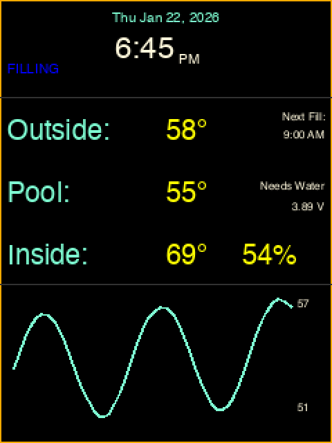

| Property | Value |
|----------|-------|
| Border width | 1px |
| Border color | #FFAA00 (orange) |
| Position | All four edges of screen |

This subtle indicator is visible on all screens without consuming screen real estate.

---

## State Indicators

### Fill Status States

| State | Display | Color | Position |
|-------|---------|-------|----------|
| Idle | (nothing) | - | - |
| Filling | "FILLING" | Blue | Left of time |

### Water Level States

Water level is binary based on float switch:

| State | Main Dashboard | Detail Screen |
|-------|---------------|---------------|
| Full | (nothing displayed) | "OK" in green |
| Needs water | "Needs Water" (right-aligned) | "NEEDS WATER" in orange |

### Data Freshness (Stale Indicator)

Instead of red text, stale data is indicated with a visual highlight:

| Age | Main Dashboard | Detail Screen |
|-----|----------------|---------------|
| < 30 minutes | Normal display | Green "Message Age" |
| ≥ 30 minutes | Amber background + ⚠ icon on row | Warning banner + orange age text |

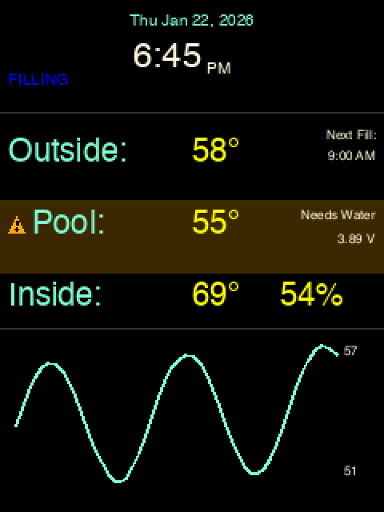

The stale indicator uses:
- Dark amber background (#3C2800) on the affected row
- Orange warning triangle icon (⚠) before the label
- Warning orange text for the label

### Battery Level

| Percentage | Color |
|------------|-------|
| > 50% | Green |
| 20-50% | Yellow |
| < 20% | Red (critical) |

---

## Implementation Notes

### Display Group Hierarchy

```text
splash (root Group)
├── background (TileGrid)
├── nonprod_border (Rectangle, if nonprod)
├── header_group
│   ├── date_label
│   ├── time_label (tap target for Settings)
│   ├── ampm_label
│   └── filling_label
├── content_group
│   ├── stale_highlight (Rectangle, hidden by default)
│   ├── stale_icon (Polygon, hidden by default)
│   ├── labels_label ("Outside:", "Pool:", "Inside:")
│   ├── temps_label (values)
│   ├── right_info_group (right-aligned items)
│   │   ├── nextFill_label
│   │   ├── needsWater_label
│   │   ├── voltage_label
│   │   └── humidity_label
├── chart_group
│   ├── sparkline
│   └── chartMinMax_label
└── dialog_group (hidden by default)
    ├── dialog_background
    ├── dialog_text
    └── dialog_buttons
```

### Screen Refresh Strategy

1. **Full refresh:** On screen transition
2. **Partial refresh:** Every 1 second for time update
3. **Data refresh:** On MQTT message receipt
4. **Chart refresh:** Every 5 minutes (configurable)
5. **Stale check:** Every 30 seconds, update indicator if needed

### Memory Optimization

- Reuse display groups between screens when possible
- Clear sparkline values before redraw, not recreate
- Use `display.auto_refresh = False` during batch updates
- Load fonts once at initialization

### Touch Calibration

Current calibration values (may need adjustment per device):

```python
calibration = ((357, 3812), (390, 3555))
```

Store calibration in `config.json` for easy adjustment without code changes.

### Burn-In Prevention (FR-DN-007)

| Parameter | Default | Configurable |
|-----------|---------|--------------|
| Idle trigger time | 5 minutes | Yes |
| Rotation duration | 7 seconds | Yes |
| Background colors | 4 (black, white, red, blue) | Yes |
| Skip on touch | Yes | No |

**Cycle sequence:**
1. Rotate display 0° → 90° → 180° → 270°
2. Show screensaver with solid color
3. Cycle through colors
4. Return to normal display

---

## Mockup Reference

All mockups are located in `docs/mockups/` at 2x scale (480x640) for clarity.

| File | Description |
|------|-------------|
| `00_navigation_flow.png` | Navigation diagram with hotzones |
| `01_main_dashboard.png` | Main dashboard - normal state |
| `02_main_dashboard_nonprod.png` | Main dashboard with nonprod border |
| `03_main_dashboard_stale.png` | Main dashboard with stale data indicator |
| `04_pool_detail.png` | Pool node detail screen |
| `05_pool_detail_stale.png` | Pool detail with stale warning |
| `06_valve_detail.png` | Valve controller - idle state |
| `07_valve_detail_filling.png` | Valve controller - active fill |
| `08_settings.png` | Settings screen |
| `09_dialog_fill_confirm.png` | Fill confirmation dialog |
| `10_dialog_reset_confirm.png` | Reset confirmation dialog |
| `11_historical_24h.png` | 24-hour sparkline chart |
| `12_historical_7d.png` | 7-day whisker chart |
| `13_historical_30d.png` | 30-day whisker chart |

To regenerate mockups after changes:

```bash
source mockups-venv/bin/activate
python docs/mockups/generate_mockups.py
```

---

## Open Questions (Resolved)

1. **Tab bar vs swipe navigation** - Hub-and-spoke pattern chosen for simplicity on small screen. Tap-to-navigate rather than swipe.

2. **Pump controls location** - Deferred to Phase 4 when pump hardware is defined. Will add new detail screen.

3. **Font sizes** - Using Adafruit circuitpython-fonts (Free Sans): 18pt for temperature values, 24pt for main time display.

4. **Touch calibration data storage** - Store in `config.json` alongside other node configuration.

5. **Stale data indicator** - Use amber background highlight with warning icon instead of red text for better visibility.

6. **Nonprod indicator** - Use 1px orange border instead of banner to save screen space.

7. **Historical chart types** - Use sparkline for 24h (continuous data), whisker charts for 7d/30d (daily min/max).

---

*This document supersedes the placeholder version and provides complete specifications for Display Node implementation (Phase 2c).*
